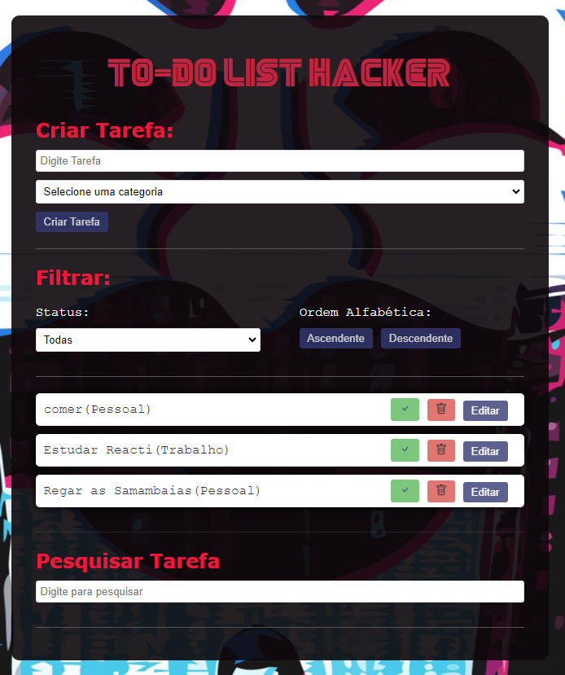

# Aplicativo de Lista de Tarefas

Este é um aplicativo de lista de tarefas desenvolvido em JavaScript e React, projetado para ajudar os usuários a gerenciar suas tarefas de forma eficiente. O aplicativo oferece recursos de criação, edição, marcação de tarefas como concluídas, além de pesquisa e filtragem para facilitar a localização de tarefas específicas.

## Índice

1. [Requisitos](#requisitos)
2. [Funcionalidades](#funcionalidades)
3. [Como Executar o Aplicativo](#como-executar-o-aplicativo)
4. [Documentação](#documentação)
   - [Como Baixar o Node.js](#como-baixar-o-nodejs)
   - [Como Baixar o Vite](#como-baixar-o-vite)
5. [Contribuições](#contribuições)
6. [Licença](#licença)
7. [Contato](#contato)

## Requisitos

- Node.js: Certifique-se de que você tenha o Node.js instalado em sua máquina. Veja como baixar o Node.js.
- Vite: O aplicativo foi desenvolvido usando o Vite como ferramenta de compilação e desenvolvimento.
- Styled Components: O aplicativo utiliza o Styled Components para gerenciar estilos e componentização.
- Biblioteca React-Icons: Utilizamos a biblioteca React-Icons para adicionar ícones aprimorados às tarefas e aos botões de ação.
- Theme-Provider: O aplicativo utiliza o Theme-Provider para gerenciar temas e estilos.

## Funcionalidades

O aplicativo oferece as seguintes funcionalidades:

- **Criar uma Tarefa:** Os usuários podem adicionar novas tarefas especificando um título e, opcionalmente, uma descrição.

- **Editar uma Tarefa:** Tarefas existentes podem ser editadas para modificar o título, a descrição ou outros detalhes.

- **Marcar uma Tarefa como Concluída:** Os usuários podem marcar tarefas como concluídas, o que as destacará como feitas.

- **Buscar uma Tarefa:** O aplicativo oferece a capacidade de buscar tarefas com base em palavras-chave, facilitando a localização de tarefas específicas.

## Como Executar o Aplicativo

Siga estas etapas para executar o aplicativo em sua máquina:

1. Certifique-se de que você tenha o Node.js instalado em sua máquina. [Veja como baixar o Node.js](#como-baixar-o-nodejs).

2. Clone este repositório para o seu ambiente de desenvolvimento.

   ```
   git clone https://github.com/Renato-Miranda/todo-list-react
   ```

3. Navegue até o diretório do projeto.

   ```
   cd todo-list-react
   ```

4. Instale as dependências do projeto.

   ```
   npm install
   ```

5. Inicie o aplicativo.

   ```
   npm run dev
   ```

O aplicativo estará disponível em `http://localhost:5173`.

# Como Utilizar o Aplicativo

Este aplicativo de lista de tarefas é fácil de usar e oferece várias funcionalidades para ajudar você a gerenciar suas tarefas. Abaixo, fornecemos um guia detalhado de exemplo sobre como utilizar as principais funcionalidades.

## Adicionar uma Tarefa

1. Digite um título para a tarefa.

   - Exemplo: "Regar as plantas"

2. Escolha uma categoria para a tarefa. Você pode criar suas próprias categorias, como "Pessoal," "Trabalho" ou "Estudos," para organizar melhor suas tarefas.

   - Exemplo: "Pessoal"

3. Pressione a tecla [Enter] ou clique no botão Criar Tarefa para adicionar a tarefa à lista.

A tarefa "Regar as Plantas" será adicionada à categoria "Casa" em sua lista de tarefas.

## Concluir uma Tarefa

1. Na lista de tarefas, você verá uma opção de marca de seleção ao lado de cada tarefa.

2. Clique na marca de seleção ao lado da tarefa que deseja marcar como concluída.

A tarefa será marcada como concluída e destacada na lista.

## Editar uma Tarefa

1. Encontre a tarefa que deseja editar na lista.

2. Clique no botão "Editar".

3. Uma caixa de edição de texto aparecerá, permitindo que você modifique o título e a categoria.

   - Exemplo: Você pode atualizar a categoria para "Trabalho" e adicionar mais detalhes à descrição, como "Desenvolver funcionalidade x."

4. Após fazer as alterações desejadas, pressione a tecla [Enter] ou clique em "Salvar".

A tarefa será atualizada com as informações editadas.

## Buscar uma Tarefa

1. Na parte inferior do aplicativo, você encontrará um campo de pesquisa.

2. Digite palavras-chave ou parte do título de uma tarefa que deseja encontrar.

   - Exemplo: Se você deseja encontrar a tarefa "Ir ao mercado," digite "mercado" na caixa de pesquisa.

3. À medida que você digita, o aplicativo atualizará automaticamente a lista de tarefas, mostrando apenas as tarefas que correspondem à sua pesquisa.



Este guia fornece exemplos práticos de como usar as funcionalidades do aplicativo, desde a adição de tarefas até a busca e edição. Sinta-se à vontade para explorar e personalizar ainda mais o uso do aplicativo de acordo com suas necessidades.

Esperamos que este guia seja útil para tornar a gestão de tarefas mais eficiente com nosso aplicativo!

## Documentação

### Como Baixar o Node.js

Para baixar o Node.js, siga as instruções na documentação oficial:

[Documentação do Node.js](https://nodejs.org/en/download/)

### Como Baixar o Vite

Para baixar o Vite, siga as instruções na documentação oficial:

[Documentação do Vite](https://vitejs.dev/guide/#scaffolding-your-first-vite-project)

## Contribuições

Se você quiser contribuir para o desenvolvimento deste projeto, siga estas etapas:

1. Fork o repositório.

2. Crie uma branch para suas alterações.

   ```
   git checkout -b minha-nova-funcionalidade
   ```

3. Faça suas alterações e commit.

   ```
   git commit -m "Adicionei uma nova funcionalidade"
   ```

4. Envie suas alterações para o seu fork.

   ```
   git push origin minha-nova-funcionalidade
   ```

5. Crie um Pull Request para revisão.

## Licença

Este projeto é licenciado sob a [Licença MIT](LICENSE).

## Contato

Se você tiver alguma dúvida ou sugestão, entre em contato com o autor:

- GitHub: [GitHub Renato](https://github.com/Renato-Miranda)
- LinkedIn: [LinkedIn Renato](https://www.linkedin.com/in/renato-miranda-185269258/)

Esperamos que este README ajude a documentar seu projeto e a torná-lo acessível aos colaboradores e usuários. Personalize-o de acordo com suas necessidades e detalhes específicos do projeto.
